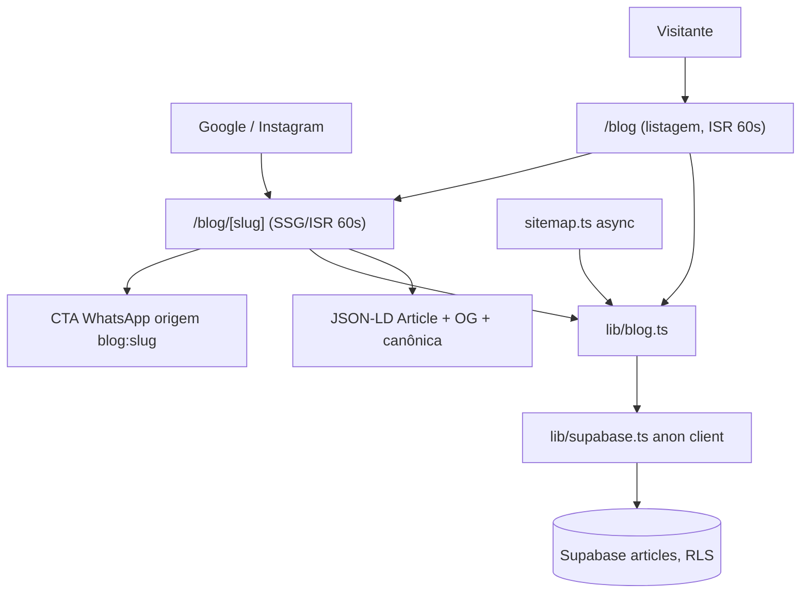

# Blog Público — Design

**Spec**: `.specs/features/blog-publico/spec.md`
**Status**: Draft

---

## Architecture Overview

Blog 100% estático com ISR: as páginas são geradas no servidor lendo o Supabase com a **anon key** (o RLS `public read published articles` já garante que só artigo `status = 'published'` é visível — rascunho vira 404 sem código extra). Revalidação por tempo (`revalidate = 60`) cumpre o AC de ≤60s; a revalidação on-demand chega com o painel-admin.



---

## Code Reuse Analysis

### Existing Components to Leverage

| Component | Location | How to Use |
| --- | --- | --- |
| `whatsappLink(origem)` | `lib/site.ts` | CTA final do artigo com origem `blog:[slug]` (KPI US-13) |
| `SITE_URL`, `SITE_NAME`, `PROFESSIONAL_NAME` | `lib/site.ts` | Canônica, OG e `author` do JSON-LD |
| `SchemaLocalBusiness.tsx` | `components/landing/` | Mesmo padrão de `<script type="application/ld+json">` para o `SchemaArticle` |
| Header/Footer/WhatsAppFloat | `app/layout.tsx` | Blog herda o layout raiz; só adicionar link "Blog" no `Header.tsx` |
| Padrão visual dos cards | `components/landing/Depoimentos.tsx` | Mesma linguagem (paleta v2.0, cantos, sombras) nos cards da listagem |

### Integration Points

| System | Integration Method |
| --- | --- |
| Supabase `articles` | Leitura anônima via `@supabase/supabase-js` (instalar); RLS filtra publicados |
| Supabase Storage `media` | `cover_url` público; liberar host `*.supabase.co` em `next.config.ts` (`images.remotePatterns`) |
| `app/sitemap.ts` | Virar `async` e concatenar slugs publicados (AC: artigo novo no sitemap) |
| painel-admin (futuro) | Chamará `revalidatePath('/blog')` on-demand; até lá o `revalidate = 60` cobre o AC |
| Vercel env | Confirmar `NEXT_PUBLIC_SUPABASE_URL`/`ANON_KEY` no painel da Vercel (existem no `.env.local`; nada em runtime os usava até agora — lembrar L-003: `env pull` mascara valores) |

---

## Components

### `lib/supabase.ts`

- **Purpose**: Cliente Supabase server-side com anon key, sem sessão/persistência.
- **Interfaces**: `supabase: SupabaseClient` (singleton).
- **Dependencies**: `@supabase/supabase-js` (novo), envs `NEXT_PUBLIC_SUPABASE_URL/ANON_KEY`.
- **Reuses**: padrão `||` (não `??`) dos fallbacks de env (L-003) — aqui sem fallback: env ausente deve **falhar o build** com mensagem clara, não degradar em silêncio.

### `lib/blog.ts`

- **Purpose**: Acesso a dados + tipo `Article`; único lugar que conhece a tabela.
- **Interfaces**:
  - `getPublishedArticles(): Promise<ArticleResumo[]>` — publicados, `published_at desc`, só campos da listagem
  - `getArticleBySlug(slug: string): Promise<Article | null>` — `null` → `notFound()`
- **Dependencies**: `lib/supabase.ts`.

### `app/blog/page.tsx`

- **Purpose**: Listagem (US "Listagem do blog").
- **Interfaces**: `revalidate = 60`; metadata própria (title, description, canônica `/blog`).
- **Comportamento**: 0 artigos → estado vazio amigável com CTA WhatsApp (origem `blog:vazio`); N artigos → grid de `ArticleCard`.

### `app/blog/[slug]/page.tsx`

- **Purpose**: Página do artigo (US "Página de artigo otimizada").
- **Interfaces**: `generateStaticParams()` (slugs publicados no build), **`dynamicParams = true`** — sem isso, artigo publicado depois do build daria 404 até o próximo deploy, quebrando o fluxo da Stella; `revalidate = 60`; `generateMetadata()` (meta title/description com fallback para `title`/`excerpt`, OG com capa, canônica).
- **Comportamento**: artigo não encontrado (inexistente ou rascunho, via RLS) → `notFound()`; renderiza capa (`next/image`), data (`published_at`, pt-BR), conteúdo, `SchemaArticle`, `CompartilharArtigo` e CTA WhatsApp origem `blog:[slug]`.

### `components/blog/ArticleCard.tsx`

- **Purpose**: Card da listagem (capa, título, resumo, data) com link para `/blog/[slug]`.
- **Reuses**: tokens visuais da identidade v2.0; `next/image` com `sizes` (LCP <2,5s).

### `components/blog/SchemaArticle.tsx`

- **Purpose**: JSON-LD `Article` (headline, image, datePublished/Modified, author = Person Stella Costa, mainEntityOfPage).
- **Reuses**: padrão de `SchemaLocalBusiness.tsx`.

### `components/blog/CompartilharArtigo.tsx` (P2)

- **Purpose**: Compartilhar via Web Share API; fallback: botão WhatsApp (`api.whatsapp.com/send?text=` com URL) + copiar link.
- **Interfaces**: `<CompartilharArtigo url title />` — client component (único do blog).

### Alterações em arquivos existentes

- `components/Header.tsx`: link "Blog" na navegação.
- `app/sitemap.ts`: `async`, concatena artigos publicados (`lastModified = updated_at`).
- `next.config.ts`: `images.remotePatterns` para o host do Supabase Storage.

---

## Data Models

```typescript
// lib/blog.ts — espelho de public.articles (somente leitura pública)
interface Article {
  id: string;
  title: string;
  slug: string;
  excerpt: string | null;
  content: string | null;      // HTML produzido pelo editor do painel
  cover_url: string | null;
  meta_title: string | null;
  meta_description: string | null;
  published_at: string | null; // ISO
  updated_at: string;
}

type ArticleResumo = Pick<
  Article,
  "slug" | "title" | "excerpt" | "cover_url" | "published_at"
>;
```

**Relationships**: nenhuma; tabela isolada. O painel-admin (M3) escreve nela.

---

## Error Handling Strategy

| Error Scenario | Handling | User Impact |
| --- | --- | --- |
| Supabase fora do ar na revalidação | Query lança erro → ISR mantém a versão anterior em cache (comportamento nativo do Next) | Leitor segue vendo a página antiga; nada quebra |
| Supabase fora do ar no build | Build falha com o erro da query | Deploy não sobe quebrado |
| Slug inexistente ou rascunho | `getArticleBySlug` → `null` → `notFound()` (RLS esconde rascunho do anon) | 404 padrão do site (`app/not-found.tsx`) |
| Artigo sem capa | OG e card usam `/imagens/stella-institucional.jpg` como fallback | Preview de compartilhamento nunca fica sem imagem |
| Imagem quebrada no conteúdo | `alt` obrigatório no HTML sanitizado; layout flui normalmente | Texto alternativo no lugar da imagem |
| Env Supabase ausente | `lib/supabase.ts` lança na inicialização com mensagem apontando a env | Build falha cedo e explícito |

---

## Tech Decisions (only non-obvious ones)

| Decision | Choice | Rationale |
| --- | --- | --- |
| Formato do `content` | HTML sanitizado, renderizado com `dangerouslySetInnerHTML` | O editor do painel (Tiptap, a definir) emite HTML; converter para markdown seria retrabalho |
| Sanitização | `sanitize-html` com allowlist, **no render** (server, roda só no ISR) | Defesa em profundidade: repo público + anon key pública; se o RLS regredir, HTML malicioso não vira XSS. Custo zero em runtime do cliente |
| Estilo do conteúdo | `@tailwindcss/typography` (`@plugin` no globals.css, classe `prose` customizada com a paleta v2.0) | Tipografia de artigo pronta e consistente; escrever manualmente seria maior e pior |
| Revalidação | `revalidate = 60` agora; `revalidatePath` on-demand fica no painel-admin | Cumpre o AC (≤60s) sem acoplar o blog a um painel que ainda não existe |
| Novos slugs pós-build | `dynamicParams = true` + `generateStaticParams` | Artigo publicado depois do deploy renderiza on-demand em vez de 404 |
| Cliente Supabase | `@supabase/supabase-js` puro (sem `@supabase/ssr`) | Não há sessão/cookie no site público; o pacote ssr só entra no painel-admin |
